# ERD النهائي v4.0 — تصميم قاعدة البيانات المتكامل

## Enterprise Inventory & Asset Management System (EIAMS) — v4.0

| الحقل | القيمة |
|---|---|
| الإصدار | 4.1 — منقّح بعد المراجعة الفنية |
| الجهة المالكة | الهيئة العامة للرقابة والتفتيش |
| المراجع | PRD v1.0, BDM v1.0, DDS v1.0, SAD v1.0, ERD v3.0 |
| التقنية المستهدفة | PostgreSQL 16 |
| نوع الـ PK | UUID (لجميع الجداول) |
| عدد الجداول | 38 جدولاً (v5) + 4 جداول مؤجلة إلى v2 |

---

## قرارات التصميم الأساسية

### 1. لماذا UUID بدلاً من Integer؟
- **الأمان:** غير قابل للتخمين (enumeration attack)
- **التوزيع:** يمكن دمج قواعد بيانات متعددة دون تعارض
- **المعايرة:** النظام قد يتوسع إلى أنظمة موزعة مستقبلاً

### 2. لماذا WarehouseDocument الموحد (Spine + Petals)؟
- **Spine:** جدول واحد لجميع أنواع المستندات (استلام، صرف، نقل، تسوية) يحمل الحقول المشتركة: الحالة، التواريخ، المنشئ، الترقيم
- **Petals:** جداول موسعة 1:1 لكل نوع مستند تحمل حقوله الخاصة:
  - ReceivingInfo: اسم المورد، رقم الفاتورة، صورة الفاتورة
  - IssueTo: جهة الصرف (موظف، قسم، جهة خارجية)
  - InventoryAdjustment: التسوية (موجود مسبقاً)
- **المكاسب:** دورة حياة موحدة (Draft → Posted)، ترقيم موحد، تقارير بدون UNION، إضافة نوع جديد = Petal جديد فقط
- **document_type يحدد السلوك عبر منطق الأعمال**

### 3. لماذا OrganizationalUnit ذاتي المرجع؟
الهيكل الحكومي قد يتغير (إضافة مستوى إداري جديد) دون تعديل قاعدة البيانات. كل المستويات (مديرية، دائرة، قسم، شعبة) في جدول واحد.

### 4. لماذا StockMovement مع balance_before / balance_after؟
- يمكن إعادة حساب الرصيد في أي وقت من الحركات
- يتوافق مع مبدأ append-only (السجل غير قابل للتعديل)
- تمييز بين الحالة الحالية (InventoryBalance) والتاريخ (StockMovement)

### 5. لماذا فصل Count عن Adjustment؟
- الجرد يكشف الفروقات فقط (لا يعدّل)
- التسوية وثيقة مستقلة تحتاج موافقة إدارية
- هذا هو Inventory Integrity Layer

### 6. لماذا CustodyHistory كـ Ledger؟
- كل تغيير في العهدة يسجل كسجل تاريخي
- موازٍ لـ StockMovement — تتبع كامل للمسؤولية
- متطلبات قانونية حكومية

### 7. Supplier_autocomplete بدلاً من جدول Supplier (في v1)
بدلاً من جدول موردين منفصل مع واجهة إدارة، نستخدم:
- حقل `supplier_name TEXT` في ReceivingInfo
- جدول `supplier_autocomplete` خفيف للأوتوكومبليت
- هذا يلغي الحاجة لواجهة إدارة موردين في v1
- في v2 يمكن إضافة جدول `Supplier` رسمي

### 8. لماذا IssueTo منفصل عن DocumentLine؟
جهة الصرف قد تكون متعددة الأنواع (موظف، قسم، مديرية، موقع، جهة خارجية). polymorphic recipient_type + recipient_id في جدول مستقل.

### 9. لماذا DocumentSequence؟
الترقيم يختلف حسب: السنة + المستودع + نوع المستند. يمنع التكرار ويسهل التتبع الورقي.

### 10. SoftFreeze بدلاً من HardFreeze للجرد
- SoftFreeze: يحذّر فقط عند إجراء عمليات أثناء الجرد، لا يمنع
- HardFreeze مؤجل للإصدارات القادمة إن لزم
- التوازن بين الرقابة واستمرارية العمل

### 11. نقل ذرّي بدون TransferRequest (في v1)
- في v1، النقل عملية ذرّية: مستند نقل واحد يُنتج حركتين (خصم من المصدر، إضافة للوجهة) في معاملة واحدة
- TransferRequest و TransferRequestLine أزيلا من v1 — لا حاجة لنقل بمرحلة عبور
- في v2 يمكن إضافة TransferRequest للنقل غير الذرّي (ship-then-receive)

---

### الجداول المؤجلة إلى الإصدارات القادمة (v2+)

| الجدول | السبب | متى يُحتاج |
|---|---|---|
| StorageLocation | المستودعات الصغيرة في البداية لا تحتاج تنظيماً داخلياً | v2 — عندما تكبر المستودعات |
| MaterialAttribute | يمكن تخزين الخصائص الإضافية كـ JSONB في Material حالياً | v2 — عند الحاجة لخصائص منظمة |
| — (مُلغى) | مسؤولية Asset تُحتسب من Custody الموحد — لم يعد ResponsibleEntity ضرورياً | — |
| Notification | الإشعارات في v1 تُدار من前端 (in-memory) | v2 — عند الحاجة لإشعارات مخزنة |
| Supplier (منفصل) | يُستبدل بـ supplier_name + supplier_autocomplete في v1 | v2 — عند الحاجة لبيانات موردين رسمية |

---

## 1. مخطط ERD العام (Mermaid)

```mermaid
erDiagram
    %% ==================== ORGANIZATION DOMAIN ====================
    Organization ||--o{ Site : contains
    Site ||--o{ Warehouse : hosts
    Site ||--o{ OrganizationalUnit : contains
    OrganizationalUnit ||--o{ OrganizationalUnit : "parent of"
    OrganizationalUnit ||--o{ Employee : employs

    %% ==================== SECURITY DOMAIN ====================
    Employee ||--o| User : "linked to"
    User ||--o{ UserRoleScope : "has"
    Role ||--o{ UserRoleScope : "assigned to"
    Role ||--o{ RolePermission : "grants"
    Permission ||--o{ RolePermission : "assigned to"

    %% ==================== CATALOG DOMAIN ====================
    MaterialDomain ||--o{ MaterialCategory : classifies
    MaterialCategory ||--o{ MaterialCategory : "parent of"
    MaterialCategory ||--o{ MaterialFamily : groups
    MaterialFamily ||--o{ Material : templates
    Material ||--o{ MaterialUnitConversion : converts
    UnitOfMeasure ||--o{ MaterialUnitConversion : "from"
    UnitOfMeasure ||--o{ Material : "base unit"
    %% NOTE: Material domain is derived via chain: Material -> Family -> Category -> Domain

    %% ==================== WAREHOUSE DOMAIN ====================
    Warehouse ||--o{ WarehouseCapability : has
    MaterialDomain ||--o{ WarehouseCapability : enables
    Site ||--o{ DocumentSequence : "sequences for"

    %% ==================== INVENTORY DOMAIN ====================
    Warehouse ||--o{ InventoryBalance : tracks
    Material ||--o{ InventoryBalance : "balanced in"
    Warehouse ||--o{ WarehouseMaterialSetting : configures
    Material ||--o{ WarehouseMaterialSetting : "configured in"
    WarehouseCapability ||--o{ WarehouseCapabilityOperation : permits
    InventoryBalance ||--o{ StockMovement : "tracked by"
    WarehouseDocument ||--o{ StockMovement : generates

    %% ==================== OPERATIONS DOMAIN ====================
    Warehouse ||--o{ WarehouseDocument : processes
    User ||--o{ WarehouseDocument : creates
    WarehouseDocument ||--o{ DocumentLine : contains
    Material ||--o{ DocumentLine : "referenced in"
    WarehouseDocument ||--o{ DocumentAttachment : has
    WarehouseDocument ||--o| IssueTo : "issued to (if Issue)"
    WarehouseDocument ||--o| ReceivingInfo : "has (if Receiving)"

    %% ==================== COUNT & ADJUSTMENT DOMAIN ====================
    Warehouse ||--o{ InventoryCount : "counted in"
    InventoryCount ||--o{ InventoryCountLine : counts
    Material ||--o{ InventoryCountLine : counted
    Asset ||--o{ InventoryCountLine : "asset counted"
    InventoryCount ||--o| InventoryAdjustment : triggers
    Warehouse ||--o{ InventoryAdjustment : adjusts
    WarehouseDocument ||--o{ InventoryAdjustment : "posts via"
    InventoryAdjustment ||--o{ AdjustmentLine : adjusts
    Material ||--o{ AdjustmentLine : "adjusted"

    %% ==================== ASSET DOMAIN ====================
    Material ||--o{ Asset : "is type of"
    Warehouse ||--o{ Asset : stores
    DocumentLine ||--o{ Asset : "received as"
    Asset ||--o{ AssetMovementHistory : "moved via"
    Asset ||--o| Custody : "held under"

    %% ==================== CUSTODY DOMAIN ====================
    Asset ||--o{ Custody : "held under"
    WarehouseDocument ||--o{ Custody : "issued by"
    WarehouseDocument ||--o{ Custody : "returned by"
    Custody ||--o{ CustodyHistory : records
    %% NOTE: holder_type + holder_id replaces Employee/OrgUnit FKs

    %% ==================== SUPPORTING ====================
    User ||--o{ AuditLog : generates
    AuditLog ||--o{ AuditLogEntry : details
```



---

## 2. شرح تفصيلي لكل جدول

### 2.1 Organization Domain (النطاق التنظيمي)

#### Organization
يمثل الكيان القانوني المالك للنظام — الهيئة العامة للرقابة والتفتيش.

| العمود | النوع | المفتاح | الشرح |
|---|---|---|---|
| organization_id | UUID | PK | معرف المؤسسة |
| name | VARCHAR(200) | | اسم المؤسسة |
| code | VARCHAR(20) | UNIQUE | رمز المؤسسة |
| status | VARCHAR(20) | | Active / Inactive |
| created_at | TIMESTAMP | | تاريخ الإنشاء |
| updated_at | TIMESTAMP | | آخر تحديث |

**علاقات:** 1:N مع Site

---

#### Site
يمثل موقعاً تشغيلياً أو جغرافياً — الإدارة الرئيسية أو فرع محافظة.

| العمود | النوع | المفتاح | الشرح |
|---|---|---|---|
| site_id | UUID | PK | معرف الموقع |
| organization_id | UUID | FK → Organization | المؤسسة المالكة |
| name | VARCHAR(200) | | اسم الموقع |
| code | VARCHAR(20) | UNIQUE | رمز الموقع |
| address | TEXT | | العنوان |
| status | VARCHAR(20) | | Active / Inactive |
| created_at | TIMESTAMP | | |
| updated_at | TIMESTAMP | | |

**علاقات:**
- N:1 مع Organization
- 1:N مع Warehouse
- 1:N مع OrganizationalUnit
- 1:N مع DocumentSequence

---

#### OrganizationalUnit
تمثل أي مستوى في الهيكل التنظيمي — مديرية، دائرة، قسم، شعبة. ذاتي المرجع.

| العمود | النوع | المفتاح | الشرح |
|---|---|---|---|
| org_unit_id | UUID | PK | معرف الوحدة |
| site_id | UUID | FK → Site | الموقع |
| parent_org_unit_id | UUID | FK → نفسه (nullable) | الوحدة الأم |
| name | VARCHAR(200) | | اسم الوحدة |
| unit_type | VARCHAR(30) | | Directorate / Department / Section / Division |
| code | VARCHAR(20) | | رمز الوحدة |
| status | VARCHAR(20) | | Active / Inactive |
| created_at | TIMESTAMP | | |
| updated_at | TIMESTAMP | | |

**علاقات:**
- N:1 مع Site
- N:1 مع نفسها (self-referencing)
- 1:N مع Employee

---

#### Employee
يمثل موظفاً في الهيئة — قد يمتلك حساباً في النظام أو لا يمتلك.

| العمود | النوع | المفتاح | الشرح |
|---|---|---|---|
| employee_id | UUID | PK | معرف الموظف |
| org_unit_id | UUID | FK → OrganizationalUnit | الوحدة التنظيمية |
| employee_number | VARCHAR(50) | UNIQUE | الرقم الوظيفي |
| full_name | VARCHAR(200) | | الاسم الكامل |
| job_title | VARCHAR(200) | | المسمى الوظيفي |
| email | VARCHAR(200) | | البريد الإلكتروني |
| phone | VARCHAR(30) | | رقم الهاتف |
| status | VARCHAR(20) | | Active / Inactive |
| created_at | TIMESTAMP | | |
| updated_at | TIMESTAMP | | |

**علاقات:**
- N:1 مع OrganizationalUnit
- 0:1 مع User
- 1:N مع Custody
- 1:N مع CustodyHistory

---

### 2.2 Security Domain (نطاق الأمان)

#### User
حساب نظامي يسمح بالدخول إلى EIAMS.

| العمود | النوع | المفتاح | الشرح |
|---|---|---|---|
| user_id | UUID | PK | معرف المستخدم |
| employee_id | UUID | FK → Employee (nullable) | الموظف المرتبط |
| username | VARCHAR(100) | UNIQUE | اسم المستخدم |
| password_hash | VARCHAR(500) | | كلمة المرور مشفرة |
| email | VARCHAR(200) | | البريد الإلكتروني |
| status | VARCHAR(20) | | Pending / Active / Suspended / Disabled |
| last_login | TIMESTAMP | | آخر تسجيل دخول |
| created_at | TIMESTAMP | | |
| updated_at | TIMESTAMP | | |

**علاقات:**
- 1:1 مع Employee (اختياري)
- 1:N مع UserRoleScope
- 1:N مع AuditLog

---

#### Role
يمثل دوراً وظيفياً في النظام.

| العمود | النوع | المفتاح | الشرح |
|---|---|---|---|
| role_id | UUID | PK | معرف الدور |
| name | VARCHAR(100) | UNIQUE | اسم الدور |
| description | TEXT | | وصف الدور |
| created_at | TIMESTAMP | | |
| updated_at | TIMESTAMP | | |

**علاقات:** 1:N مع UserRoleScope, 1:N مع RolePermission

---

#### Permission
صلاحية فردية — PostReceivingDocument, ViewInventoryReport...

| العمود | النوع | المفتاح | الشرح |
|---|---|---|---|
| permission_id | UUID | PK | معرف الصلاحية |
| name | VARCHAR(200) | | اسم الصلاحية |
| code | VARCHAR(100) | UNIQUE | كود الصلاحية |
| module | VARCHAR(50) | | الوحدة (Identity, Catalog, Inventory...) |
| created_at | TIMESTAMP | | |

---

#### UserRoleScope
الربط بين المستخدم والدور مع النطاق.

| العمود | النوع | المفتاح | الشرح |
|---|---|---|---|
| user_role_scope_id | UUID | PK | معرف الإسناد |
| user_id | UUID | FK → User | المستخدم |
| role_id | UUID | FK → Role | الدور |
| scope_type | VARCHAR(30) | | Enterprise / Site / Warehouse |
| scope_id | UUID | | معرف النطاق |
| effective_from | TIMESTAMP | | تاريخ بدء الصلاحية |
| effective_to | TIMESTAMP | nullable | تاريخ انتهاء الصلاحية |
| created_at | TIMESTAMP | | |

---

#### RolePermission
ربط الصلاحيات بالأدوار.

| العمود | النوع | المفتاح | الشرح |
|---|---|---|---|
| role_permission_id | UUID | PK | |
| role_id | UUID | FK → Role | |
| permission_id | UUID | FK → Permission | |

---

### 2.3 Catalog Domain (كتالوج المواد)

#### MaterialDomain
مجال المادة — التصنيف الأعلى.

| العمود | النوع | المفتاح | الشرح |
|---|---|---|---|
| material_domain_id | UUID | PK | معرف المجال |
| name | VARCHAR(200) | | اسم المجال |
| code | VARCHAR(20) | UNIQUE | رمز المجال |
| description | TEXT | | وصف المجال |
| status | VARCHAR(20) | | Active / Inactive |
| created_at | TIMESTAMP | | |
| updated_at | TIMESTAMP | | |

**علاقات:** 1:N مع MaterialCategory, 1:N مع Material, 1:N مع WarehouseCapability

---

#### MaterialCategory
تصنيف المواد — ذاتي المرجع.

| العمود | النوع | المفتاح | الشرح |
|---|---|---|---|
| category_id | UUID | PK | معرف التصنيف |
| material_domain_id | UUID | FK → MaterialDomain | المجال |
| parent_category_id | UUID | FK → نفسه (nullable) | التصنيف الأم |
| name | VARCHAR(200) | | اسم التصنيف |
| code | VARCHAR(20) | UNIQUE | رمز التصنيف |
| status | VARCHAR(20) | | Active / Inactive |
| created_at | TIMESTAMP | | |
| updated_at | TIMESTAMP | | |

---

#### MaterialFamily
عائلة المواد.

| العمود | النوع | المفتاح | الشرح |
|---|---|---|---|
| family_id | UUID | PK | معرف العائلة |
| category_id | UUID | FK → MaterialCategory | التصنيف |
| name | VARCHAR(200) | | اسم العائلة |
| code | VARCHAR(20) | | رمز العائلة |
| status | VARCHAR(20) | | Active / Inactive |
| created_at | TIMESTAMP | | |
| updated_at | TIMESTAMP | | |

---

#### Material

> **D-MAT-01 override:** Material kind and tracking belong on Material, not
> MaterialFamily. `Consumable` is Quantity-only with no asset number or
> custody; `Durable` is Quantity or Serial with mandatory custody but no asset
> number; `Asset` is Serial-only with a required internal asset number,
> registry record, and mandatory custody. A serial number is not an asset
> number and does not make a Durable an Asset.
>
> **D-UOM-01 override:** the Material, not its family or warehouse, owns one
> base unit. A reusable unit such as Carton has no global packaging factor;
> its alternate-unit relationship and factor are specific to one Material.
المادة — تعريف مادة في الكتالوج المركزي.

| العمود | النوع | المفتاح | الشرح |
|---|---|---|---|
| material_id | UUID | PK | معرف المادة |
| family_id | UUID | FK → MaterialFamily (nullable) | عائلة المادة (اختيارية في v1) |
| name_ar | VARCHAR(500) | | الاسم بالعربية |
| name_en | VARCHAR(500) | nullable | الاسم بالإنجليزية |
| code | VARCHAR(100) | UNIQUE | كود المادة |
| description | TEXT | nullable | وصف المادة |
| search_aliases | TEXT | nullable | أسماء بديلة للبحث |
| attributes | JSONB | nullable | خصائص إضافية (بديل MaterialAttribute في v1) |
| material_kind | VARCHAR(20) | | Consumable / Durable / Asset — authoritative |
| tracking_type | VARCHAR(20) | | Quantity / Serial — constrained by D-MAT-01 |
| base_unit_id | UUID | FK → UnitOfMeasure | وحدة أساس المخزون الوحيدة لهذه المادة |
| requires_asset_number | BOOLEAN | | derived only: true exactly for Asset; not independently editable |
| status | VARCHAR(20) | | Active / Inactive / Archived |
| row_version | INTEGER | | للتحقق من التزامن |
| created_at | TIMESTAMP | | |
| updated_at | TIMESTAMP | | |

**ملاحظات:**
- خصائص المادة الإضافية تُخزن في `attributes` (JSONB) بدلاً من جدول MaterialAttribute المنفصل (v2).
- مجال المادة (MaterialDomain) يُشتق من سلسلة التصنيف (MaterialFamily → Category → Domain)، ولا يُخزّن مباشرة في Material لتجنب الازدواجية.
- `family_id` اختياري (nullable) — يمكن أن ترتبط المادة مباشرة بالتصنيف في v1.

**علاقات:**
- N:1 مع MaterialFamily (nullable)
- مجال المادة يُحتسب عبر: Material → MaterialFamily → MaterialCategory → MaterialDomain
- 1:N مع MaterialUnitConversion
- 1:N مع InventoryBalance
- 1:N مع DocumentLine
- 1:N مع Asset (فقط إذا material_kind = Asset)

---

#### UnitOfMeasure
وحدة القياس.

| العمود | النوع | المفتاح | الشرح |
|---|---|---|---|
| uom_id | UUID | PK | |
| name | VARCHAR(100) | | الاسم |
| symbol | VARCHAR(10) | | الرمز |
| unit_type | VARCHAR(30) | | Count / Weight / Volume / Length |

---

#### MaterialUnitConversion
علاقة وحدة بديلة خاصة بمادة واحدة، وتتحول مباشرة إلى وحدة أساس المادة.
اسم وحدة القياس العام، مثل Carton، لا يحدد كمية عالمية.

| العمود | النوع | المفتاح | الشرح |
|---|---|---|---|
| conversion_id | UUID | PK | |
| material_id | UUID | FK → Material | المادة |
| from_unit_id | UUID | FK → UnitOfMeasure | الوحدة البديلة |
| conversion_factor | DECIMAL(18,6) | | موجب؛ عدد وحدات أساس المادة في وحدة بديلة واحدة |
| status | VARCHAR(20) | | Active / Archived |
| row_version | INTEGER | | للتحقق من التزامن |

الوحدة الهدف مشتقة من `Material.base_unit_id`. يمنع الخادم تحويل وحدة الأساس
إلى نفسها أو تكرار التحويل النشط `(material_id, from_unit_id)`. لا تُحذف أو
تُستبدل قيمة تحويل استُخدمت في بند مرحّل؛ تُؤرشف/تُعطّل ثم ينشأ تحويل بديل.

مثالان: 1 Carton من الأقلام = 12 Pieces، و1 Carton من حبر الطابعات = 6 Boxes.

---

### 2.4 Warehouse Domain (المستودعات)

#### Warehouse
المستودع — وحدة تشغيلية مستقلة.

| العمود | النوع | المفتاح | الشرح |
|---|---|---|---|
| warehouse_id | UUID | PK | معرف المستودع |
| site_id | UUID | FK → Site | الموقع |
| name | VARCHAR(200) | | اسم المستودع |
| code | VARCHAR(20) | UNIQUE | رمز المستودع |
| warehouse_type | VARCHAR(20) | | Main / Sub / Transit / Virtual |
| can_hold_stock | BOOLEAN | | يمكنه تخزين مخزون |
| can_supply_governorates | BOOLEAN | | يغذي المحافظات |
| status | VARCHAR(20) | | Active / Inactive |
| row_version | INTEGER | | |
| created_at | TIMESTAMP | | |
| updated_at | TIMESTAMP | | |

**علاقات:**
- N:1 مع Site
- 1:N مع WarehouseCapability
- 1:N مع InventoryBalance
- 1:N مع WarehouseDocument
- 1:N مع InventoryCount
- 1:N مع Asset

---

#### WarehouseCapability
قدرة المستودع — تحدد مجالات المواد التي يستطيع المستودع إدارتها.

| العمود | النوع | المفتاح | الشرح |
|---|---|---|---|
| capability_id | UUID | PK | |
| warehouse_id | UUID | FK → Warehouse | |
| material_domain_id | UUID | FK → MaterialDomain | |
| status | VARCHAR(20) | | Active / Inactive |

---

#### WarehouseCapabilityOperation *(جديد v5 — بديل عن أعمدة BOOLEAN)*
العمليات المسموحة لكل قدرة — يسمح بإضافة عمليات جديدة دون ALTER TABLE (D-CAP-01).

| العمود | النوع | المفتاح | الشرح |
|---|---|---|---|
| cap_op_id | UUID | PK | |
| capability_id | UUID | FK → WarehouseCapability | |
| operation_type | VARCHAR(20) | UNIQUE(capability_id, operation_type) | Receiving / Issue / Transfer / Count / Return |

---

#### DocumentSequence
يدير الترقيم التلقائي للمستندات.

| العمود | النوع | المفتاح | الشرح |
|---|---|---|---|
| sequence_id | UUID | PK | |
| document_type | VARCHAR(30) | | نوع المستند |
| site_id | UUID | FK → Site | الموقع |
| warehouse_id | UUID | FK → Warehouse (nullable) | المستودع (اختياري) |
| year | INTEGER | | السنة |
| last_sequence | INTEGER | | آخر رقم تسلسلي |
| row_version | INTEGER | | |

الرقم يتكون من: type-year-site-warehouse-sequence

---

### 2.5 Inventory Domain (المخزون)

#### InventoryBalance
الرصيد الحالي لمادة في مستودع. UNIQUE (warehouse_id, material_id).

| العمود | النوع | المفتاح | الشرح |
|---|---|---|---|
| balance_id | UUID | PK | |
| warehouse_id | UUID | FK → Warehouse | |
| material_id | UUID | FK → Material | |
| quantity | DECIMAL(18,3) | | الكمية الحالية (cache، تُحسب من حركات StockMovement) |
| last_updated | TIMESTAMP | | آخر تحديث |
| row_version | INTEGER | | |

**ملاحظة:** في v1 لا يوجد `location_id` (StorageLocation مؤجل). الرصيد على مستوى المستودع فقط.

---

#### WarehouseMaterialSetting
إعدادات مادة داخل مستودع محدد.

| العمود | النوع | المفتاح | الشرح |
|---|---|---|---|
| setting_id | UUID | PK | |
| warehouse_id | UUID | FK → Warehouse | |
| material_id | UUID | FK → Material | |
| min_quantity | DECIMAL(18,3) | | الحد الأدنى |
| max_quantity | DECIMAL(18,3) | | الحد الأعلى |
| reorder_point | DECIMAL(18,3) | | نقطة إعادة الطلب (مستقبلاً) |
| status | VARCHAR(20) | | Active / Inactive |
| row_version | INTEGER | | |

---

#### StockMovement
سجل حركة المخزون — append-only، غير قابل للتعديل أو الحذف.

| العمود | النوع | المفتاح | الشرح |
|---|---|---|---|
| movement_id | UUID | PK | |
| warehouse_id | UUID | FK → Warehouse | |
| material_id | UUID | FK → Material | |
| document_id | UUID | FK → WarehouseDocument | |
| line_id | UUID | FK → DocumentLine | **UNIQUE**(document_id, line_id, movement_type) |
| movement_type | VARCHAR(30) | | Receiving / Issue / TransferIn / TransferOut / AdjustmentIncrease / AdjustmentDecrease / Return |
| quantity | DECIMAL(18,3) | | الكمية (موجبة = زيادة، سالبة = نقصان) |
| quantity_before | DECIMAL(18,3) | | الرصيد قبل الحركة |
| quantity_after | DECIMAL(18,3) | | الرصيد بعد الحركة |
| posted_at | TIMESTAMP | | تاريخ الترحيل |
| posted_by | UUID | FK → User | منفذ العملية |

---

<!-- ~~OpeningBalance~~ — أزيل في v5، اندمج في WarehouseDocument per D-OPEN-01. -->

---

### 2.6 Operations Domain (العمليات)

#### WarehouseDocument
الوثيقة التشغيلية الموحدة — Spine لكل أنواع المستندات.

| العمود | النوع | المفتاح | الشرح |
|---|---|---|---|
| document_id | UUID | PK | |
| warehouse_id | UUID | FK → Warehouse | المستودع |
| created_by | UUID | FK → User | المنشئ |
| posted_by | UUID | FK → User (nullable) | المرحل |
| document_type | VARCHAR(30) | | Receiving / Issue / Transfer | TransferOutbound / TransferInbound / Adjustment / Opening / Return |
| paper_document_number | VARCHAR(100) | | رقم المستند الورقي |
| paper_document_year | INTEGER | | السنة |
| system_reference_number | VARCHAR(100) | UNIQUE | رقم المرجع النظمي |
| document_status | VARCHAR(20) | | Draft / Submitted / Posted / Reversed / Cancelled / Rejected |
| signed_copy_attachment_id | UUID | FK → DocumentAttachment (nullable) | معرف النسخة الورقية الموقعة — إلزامي قبل الترحيل |
| notes | TEXT | | ملاحظات |
| posted_at | TIMESTAMP | nullable | تاريخ الترحيل |
| row_version | INTEGER | | |
| created_at | TIMESTAMP | | |
| updated_at | TIMESTAMP | | |

**علاقات (Spine + Petals):**
- N:1 مع Warehouse
- N:1 مع User (منشئ)
- 1:N مع DocumentLine (بنود مشتركة)
- 1:N مع DocumentAttachment (مرفقات مشتركة)
- 1:N مع StockMovement (حركات مخزنية)
- **1:1 مع ReceivingInfo** (Petal — للاستلام فقط)
- **1:1 مع IssueTo** (Petal — للصرف فقط)
- **1:N مع InventoryAdjustment** (Petal — للتسوية)

---

#### ReceivingInfo
Petal خاص بمستندات الاستلام — الحقول الخاصة بالاستلام من مورد.

| العمود | النوع | المفتاح | الشرح |
|---|---|---|---|
| document_id | UUID | PK, FK → WarehouseDocument | معرف المستند (1:1) |
| supplier_name | VARCHAR(300) | NOT NULL | اسم المورد (نص حر + autocomplete) |
| invoice_number | VARCHAR(100) | | رقم الفاتورة |
| delivery_note | TEXT | nullable | مذكرة التسليم / ملاحظات الاستلام |
| invoice_image_path | VARCHAR(500) | nullable | مسار صورة الفاتورة المرفوعة |

**لماذا supplier_name نص وليس FK لجدول Supplier؟**
- في v1، لا يوجد جدول موردين منفصل ولا واجهة إدارة
- المستخدم يكتب اسم المورد أو يختاره من autocomplete
- الأسماء تتجمع في جدول `supplier_autocomplete` للاقتراحات المستقبلية
- في v2 يمكن إضافة جدول `Supplier` رسمي وربطه

---

#### IssueTo
Petal خاص بمستندات الصرف — يحدد جهة الصرف.

| العمود | النوع | المفتاح | الشرح |
|---|---|---|---|
| issue_to_id | UUID | PK | |
| document_id | UUID | FK → WarehouseDocument | UNIQUE (1:1) |
| recipient_type | VARCHAR(30) | | Employee / OrganizationalUnit / Site / ExternalEntity |
| recipient_id | UUID | | معرف الجهة المستلمة |
| notes | TEXT | | |

**لماذا polymorphic recipient؟** لأن الصرف قد يكون لموظف أو قسم أو مديرية أو موقع أو جهة خارجية.

---

#### DocumentLine
بند المستند — مادة وكمية ضمن وثيقة. مشترك بين جميع أنواع المستندات.

| العمود | النوع | المفتاح | الشرح |
|---|---|---|---|
| line_id | UUID | PK | |
| document_id | UUID | FK → WarehouseDocument | |
| material_id | UUID | FK → Material | |
| line_type | VARCHAR(30) | | Normal / Asset |
| quantity | DECIMAL(18,3) | | الكمية المدخلة |
| unit_id | UUID | FK → UnitOfMeasure (nullable) | وحدة القياس المدخلة |
| conversion_id | UUID | FK → MaterialUnitConversion (nullable) | لقطة التحويل المختار |
| conversion_factor | DECIMAL(18,6) | nullable | عامل التحويل وقت الترحيل |
| base_quantity | DECIMAL(18,3) | | الكمية المحسوبة بالوحدة الأساسية |
| unit_price | DECIMAL(18,2) | nullable | سعر الوحدة |
| batch_number | VARCHAR(100) | nullable | رقم الدفعة |
| expiry_date | DATE | nullable | تاريخ انتهاء الصلاحية |
| notes | TEXT | | |

**ملاحظة:** في v1 لا يوجد `location_id` (StorageLocation مؤجل).

---

#### DocumentAttachment
المستندات المرفوعة — النسخ الورقية الموقعة.

| العمود | النوع | المفتاح | الشرح |
|---|---|---|---|
| attachment_id | UUID | PK | |
| document_id | UUID | FK → WarehouseDocument | |
| file_path | VARCHAR(500) | | مسار الملف |
| original_filename | VARCHAR(500) | | اسم الملف الأصلي |
| mime_type | VARCHAR(100) | | نوع الملف |
| file_size | BIGINT | | حجم الملف |
| checksum | VARCHAR(64) | | المجموع الاختباري (SHA-256) |
| uploaded_by | UUID | FK → User | |
| uploaded_at | TIMESTAMP | | |

---

#### supplier_autocomplete
جدول مساعد للأوتوكومبليت — يُملأ تلقائياً عند إدخال أسماء موردين جدد.

| العمود | النوع | المفتاح | الشرح |
|---|---|---|---|
| name | VARCHAR(300) | PK | اسم المورد (نص فريد) |
| use_count | INT | DEFAULT 1 | عدد مرات الاستخدام |
| last_used_at | TIMESTAMP | DEFAULT NOW() | آخر مرة استخدم |

```sql
CREATE INDEX idx_supplier_name_trgm ON supplier_autocomplete USING GIN (name gin_trgm_ops);
```

**كيف يعمل:**
- عند كتابة المستخدم لحرف → `SELECT name FROM supplier_autocomplete WHERE name ILIKE '%نص%' ORDER BY use_count DESC LIMIT 10`
- عند اختيار اسم موجود → `UPDATE use_count++`
- عند إدخال اسم جديد → `INSERT INTO supplier_autocomplete (name) VALUES ('جديد')`
- لا يحتاج واجهة إدارة — يُملأ تلقائياً

---

### 2.7 Count & Adjustment Domain (الجرد والتسوية)

#### InventoryCount
جلسة الجرد.

| العمود | النوع | المفتاح | الشرح |
|---|---|---|---|
| count_id | UUID | PK | |
| warehouse_id | UUID | FK → Warehouse | |
| created_by | UUID | FK → User | |
| approved_by | UUID | FK → User (nullable) | |
| count_type | VARCHAR(30) | | Full / Partial / SpotCheck / AssetVerification |
| scope_type | VARCHAR(30) | | AllMaterials / ByDomain / ByCategory |
| freeze_policy | VARCHAR(20) | | SoftFreeze / NoFreeze (HardFreeze مؤجل) |
| status | VARCHAR(20) | | Planned / InProgress / Completed / Approved |
| started_at | TIMESTAMP | | |
| closed_at | TIMESTAMP | nullable | |
| notes | TEXT | | |
| row_version | INTEGER | | |

**ملاحظة:** في v1 نستخدم SoftFreeze (تحذير فقط). HardFreeze و NoFreeze مؤجلان لإصدارات لاحقة.

---

#### InventoryCountLine
بند الجرد.

| العمود | النوع | المفتاح | الشرح |
|---|---|---|---|
| count_line_id | UUID | PK | |
| count_id | UUID | FK → InventoryCount | |
| material_id | UUID | FK → Material | |
| asset_id | UUID | FK → Asset (nullable) | للأصول الفردية |
| system_quantity | DECIMAL(18,3) | | الكمية المسجلة |
| actual_quantity | DECIMAL(18,3) | | الكمية الفعلية |
| difference | DECIMAL(18,3) | | الفرق = actual - system |
| reason | TEXT | nullable | سبب الفرق |

---

#### InventoryAdjustment
وثيقة التسوية — بتالة (Petal) ترتبط بـ WarehouseDocument.

| العمود | النوع | المفتاح | الشرح |
|---|---|---|---|
| adjustment_id | UUID | PK | |
| warehouse_id | UUID | FK → Warehouse | |
| count_id | UUID | FK → InventoryCount (nullable) | الجرد المرجعي |
| document_id | UUID | FK → WarehouseDocument | مستند الترحيل (Spine) |
| created_by | UUID | FK → User | |
| approved_by | UUID | FK → User (nullable) | |
| status | VARCHAR(20) | | Draft / Submitted / Approved / Posted |
| reason | TEXT | nullable | سبب التسوية |
| posted_at | TIMESTAMP | nullable | |
| row_version | INTEGER | | |

---

#### AdjustmentLine
بند التسوية.

| العمود | النوع | المفتاح | الشرح |
|---|---|---|---|
| adjustment_line_id | UUID | PK | |
| adjustment_id | UUID | FK → InventoryAdjustment | |
| material_id | UUID | FK → Material | |
| adjustment_type | VARCHAR(20) | | Increase / Decrease |
| quantity | DECIMAL(18,3) | | الكمية |
| reason | TEXT | nullable | |

---

### 2.8 Asset Domain (الأصول)

#### Asset
الأصل — نسخة فعلية محددة من مادة من نوع Asset.

| العمود | النوع | المفتاح | الشرح |
|---|---|---|---|
| asset_id | UUID | PK | |
| material_id | UUID | FK → Material | نوع الأصل |
| warehouse_id | UUID | FK → Warehouse (nullable) | المستودع الحالي |
| receipt_line_id | UUID | FK → DocumentLine (nullable) | بند الاستلام |
| asset_number | VARCHAR(100) | UNIQUE | رقم الأصل الداخلي |
| serial_number | VARCHAR(200) | nullable | الرقم التسلسلي |
| acquisition_date | DATE | | تاريخ الحصول |
| warranty_expiry | DATE | nullable | تاريخ انتهاء الضمان |
| row_version | INTEGER | | |
| created_at | TIMESTAMP | | |
| updated_at | TIMESTAMP | | |

**ملاحظة v5:** حُذف `status` من الجدول (D-AST-02). يُشتق الوضع الحالي من `v_asset_current_status` عبر `Custody` و `AssetMovementHistory`. في v1 لا يوجد `location_id` (StorageLocation مؤجل). مسؤولية الأصل تُحتسب من عهدة Custody النشطة. تم حذف `current_custody_id` المباشر تجنبًا للFK الدائري — يُشتق الحامل الحالي من جدول Custody.

---

#### AssetMovementHistory
سجل حركة الأصل — append-only.

| العمود | النوع | المفتاح | الشرح |
|---|---|---|---|
| movement_id | UUID | PK | |
| asset_id | UUID | FK → Asset | |
| document_id | UUID | FK → WarehouseDocument | المرجع |
| from_warehouse_id | UUID | FK → Warehouse (nullable) | من مستودع |
| to_warehouse_id | UUID | FK → Warehouse (nullable) | إلى مستودع |
| movement_type | VARCHAR(30) | | Received / Transferred / Issued / Returned / Adjusted |
| moved_at | TIMESTAMP | | |
| moved_by | UUID | FK → User | |

---

### 2.9 Custody Domain (العهد)

#### Custody

> **D-MAT-01 provisional-contract note:** This historical physical table is
> Asset-backed only. The provisional OpenAPI extends custody with
> `MaterialQuantity` and `TrackedUnit` responsibility subjects with partial
> assignment and return; backend implementation and API-owner ratification
> remain required, and frontend work must not fake server behavior.
سجل المسؤولية الموحد للأصل — العهدة الشخصية والمسؤولية الإدارية في جدول واحد.

| العمود | النوع | المفتاح | الشرح |
|---|---|---|---|
| custody_id | UUID | PK | |
| asset_id | UUID | FK → Asset | الأصل |
| holder_type | VARCHAR(20) | NOT NULL | Employee / OrganizationalUnit |
| holder_id | UUID | NOT NULL | معرف الحامل (employee_id أو org_unit_id) |
| custody_kind | VARCHAR(20) | NOT NULL | Personal / Operational |
| issue_document_id | UUID | FK → WarehouseDocument | مستند الصرف |
| return_document_id | UUID | FK → WarehouseDocument (nullable) | مستند الإرجاع |
| status | VARCHAR(20) | | Active / Returned / Transferred / Lost / Disposed |
| issued_at | TIMESTAMP | | |
| returned_at | TIMESTAMP | nullable | |
| notes | TEXT | | |

**Pending Custody** = عهدة نوع Operational (holder_type='OrganizationalUnit') لم تتحول بعد إلى Personal.

**قيود:**
- أصل واحد ← عهدة نشطة واحدة فقط (partial unique index: `UNIQUE(asset_id) WHERE status='Active'`)
- custody_kind = Personal ⇒ holder_type = Employee

---

#### CustodyHistory
سجل تاريخي لانتقالات العهدة — append-only.

| العمود | النوع | المفتاح | الشرح |
|---|---|---|---|
| history_id | UUID | PK | |
| custody_id | UUID | FK → Custody | |
| asset_id | UUID | FK → Asset | |
| change_type | VARCHAR(30) | | Assigned / Transferred / Returned / LostFound / Disposed |
| from_holder_type | VARCHAR(20) | nullable | Employee / OrganizationalUnit |
| from_holder_id | UUID | nullable | معرف الحامل السابق |
| to_holder_type | VARCHAR(20) | nullable | Employee / OrganizationalUnit |
| to_holder_id | UUID | nullable | معرف الحامل الجديد |
| from_kind | VARCHAR(20) | nullable | Personal / Operational |
| to_kind | VARCHAR(20) | nullable | Personal / Operational |
| change_date | TIMESTAMP | | |
| document_id | UUID | FK → WarehouseDocument (nullable) | |
| notes | TEXT | | |

---

### 2.10 Supporting Domain (الدعم)

#### AuditLog
سجل التدقيق — append-only، للقراءة فقط.

| العمود | النوع | المفتاح | الشرح |
|---|---|---|---|
| audit_id | UUID | PK | |
| user_id | UUID | FK → User | |
| entity_type | VARCHAR(50) | | نوع الكيان |
| entity_id | UUID | | معرف الكيان |
| action | VARCHAR(30) | | Create / Update / Delete / Approve / Reject / Post / Cancel |
| summary | JSONB | nullable | ملخص غير إلزامي (بديل عن old_values/new_values v4) |
| ip_address | VARCHAR(50) | | |
| user_agent | TEXT | nullable | |
| created_at | TIMESTAMP | | |

**ملاحظة v5:** استُبدل `old_values`/`new_values` JSONB بـ `AuditLogEntry` لكل حقل (D-AUD-01).

#### AuditLogEntry *(جديد v5 — تفصيل لكل حقل متغير)*
صف واحد لكل حقل متغير في العملية — يمكّن البحث المفهرس لكل حقل.

| العمود | النوع | المفتاح | الشرح |
|---|---|---|---|
| entry_id | UUID | PK | |
| log_id | UUID | FK → AuditLog | |
| field_name | VARCHAR(100) | | اسم الحقل المتغير |
| old_value | TEXT | nullable | القيمة قبل التغيير |
| new_value | TEXT | nullable | القيمة بعد التغيير |

**استعلامات:** "من غيّر سعر المادة X؟" → `SELECT * FROM AuditLogEntry WHERE field_name = 'unit_price'`. "الفرق الكامل للمستند Y" → `SELECT * FROM AuditLogEntry WHERE log_id IN (SELECT audit_id FROM AuditLog WHERE entity_id = 'Y')`.

---

## 3. ملخص الجداول والعلاقات

### 3.1 الجداول حسب النطاق

| النطاق | الجداول | العدد |
|---|---|---|
| Organization | Organization, Site, OrganizationalUnit, Employee | 4 |
| Security | User, Role, Permission, UserRoleScope, RolePermission | 5 |
| Catalog | MaterialDomain, MaterialCategory, MaterialFamily, Material, UnitOfMeasure, MaterialUnitConversion | 6 |
| Warehouse | Warehouse, WarehouseCapability, WarehouseCapabilityOperation, DocumentSequence | 4 |
| Inventory | InventoryBalance, WarehouseMaterialSetting, StockMovement | 3 |
| Operations | WarehouseDocument, DocumentLine, DocumentAttachment, IssueTo, ReceivingInfo, TransferInfo, supplier_autocomplete | 7 |
| Count & Adjustment | InventoryCount, InventoryCountLine, InventoryAdjustment, AdjustmentLine | 4 |
| Asset | Asset, AssetMovementHistory | 2 |
| Custody | Custody, CustodyHistory | 2 |
| Supporting | AuditLog, AuditLogEntry | 2 |
| **المجموع** | | **38** |

### 3.2 الجداول المؤجلة إلى v2+ والمُلغاة في v5

| الجدول | النطاق | السبب |
|---|---|---|
| StorageLocation | Warehouse | المستودعات في v1 صغيرة — لا حاجة لتنظيم داخلي |
| MaterialAttribute | Catalog | يُستبدل بحقل JSONB في Material في v1 |
| Supplier | Operations | يُستبدل بـ supplier_name + supplier_autocomplete |
| Notification | Supporting | الإشعارات في v1 تُدار من الـ Frontend |
| ~~OpeningBalance~~ (مُلغى v5) | Inventory | اندمج في WarehouseDocument per D-OPEN-01 |
| ~~ResponsibleEntity~~ (مُلغى) | — | مسؤولية Asset تُحتسب من Custody الموحد |

### 3.3 جداول Append-Only (غير قابلة للتعديل أو الحذف)

| الجدول | السبب |
|---|---|
| StockMovement | سجل حركات المخزون — أساس التدقيق |
| AuditLog | سجل التدقيق — متطلب قانوني |
| AuditLogEntry | سجل تفاصيل التدقيق لكل حقل — متطلب قانوني |
| CustodyHistory | سجل تاريخ العهود — متطلب قانوني |
| AssetMovementHistory | سجل حركات الأصول |

### 3.4 جداول Soft Delete

| الجدول | السياسة |
|---|---|
| User | يعطّل فقط (status = Disabled) |
| Material | يؤرشف فقط (status = Archived) |
| Warehouse | يعطّل فقط (status = Inactive) |

### 3.5 العلاقات الرئيسية

| العلاقة | النوع | الشرح |
|---|---|---|
| Organization → Site | 1:N | مؤسسة → مواقعها |
| Site → Warehouse | 1:N | موقع → مستودعاته |
| Site → OrganizationalUnit | 1:N | موقع → وحداته التنظيمية |
| OrganizationalUnit → Employee | 1:N | وحدة → موظفيها |
| MaterialDomain → MaterialCategory → MaterialFamily → Material | 1:N (مشتق) | مجال المادة يُحتسب من سلسلة التصنيف — لا يُخزّن مباشرة |
| Material → InventoryBalance | 1:N | مادة → أرصدتها |
| WarehouseDocument → StockMovement | 1:N | مستند → حركاته |
| WarehouseDocument → ReceivingInfo | 1:1 | مستند استلام → بيانات الاستلام (Petal) |
| WarehouseDocument → IssueTo | 1:1 | مستند صرف → جهة الصرف (Petal) |
| WarehouseDocument → InventoryAdjustment | 1:N | مستند تسوية → التسوية (Petal) |
| Material → Asset | 1:N | مادة أصل → نسخها الفعلية |
| Asset → Custody | 1:N | أصل → سجل عهداته (نشطة واحدة فقط لكل أصل) |
| Custody → CustodyHistory | 1:N | عهدة → سجلها التاريخي |
| InventoryCount → InventoryAdjustment | 1:1 | جرد → تسويته |

---

*تم تصميم قاعدة البيانات v4.1 لتكون الأساس الصلب للإصدار الأول، بعد المراجعة الفنية التي شملت: توحيد سجل Custody، إزالة TransferRequest (نقل ذرّي)، تبسيط دورة حياة المستند، إزالة الحقول الميتة من InventoryBalance، وجعل family_id اختيارياً.*

*آخر تحديث: يوليو 2026*
